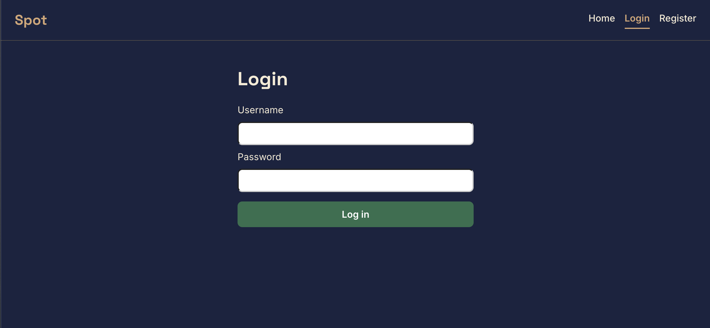
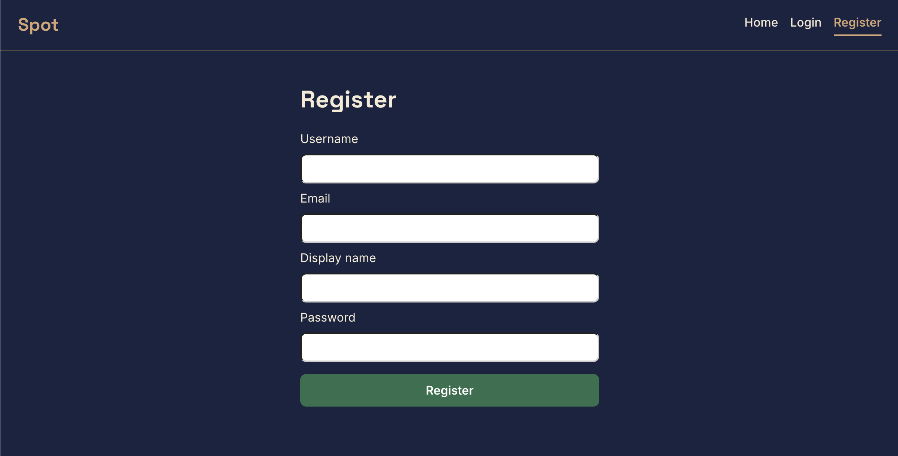
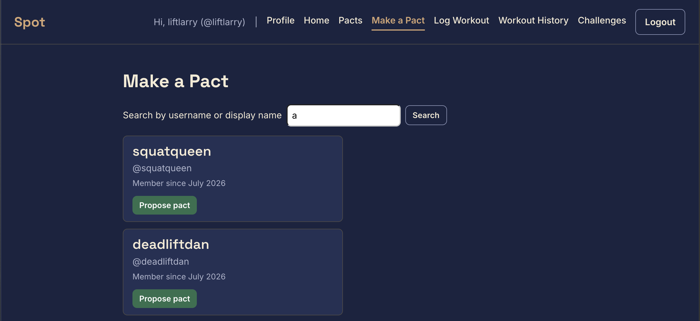
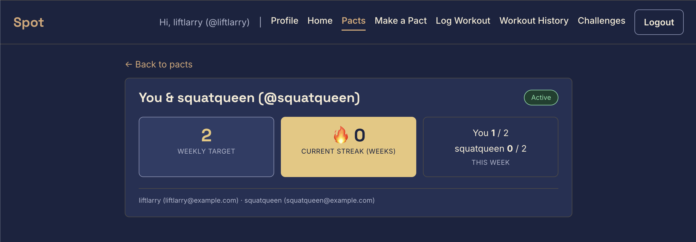
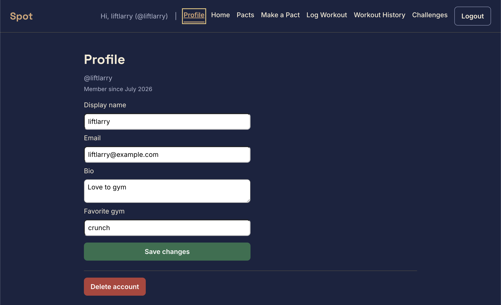
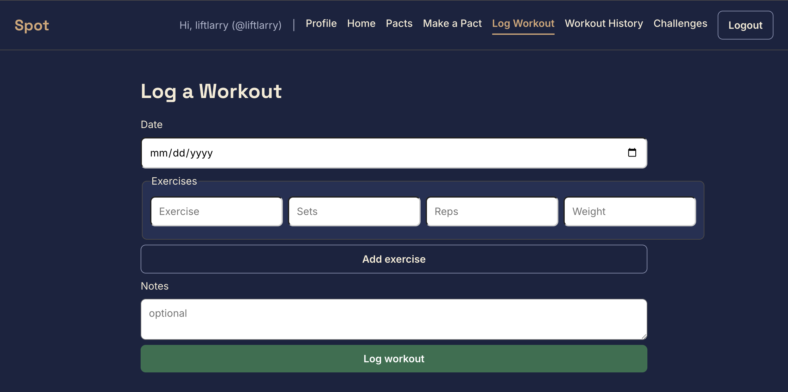
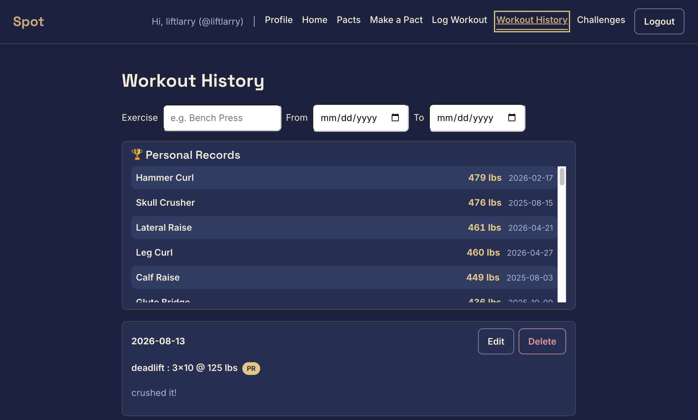
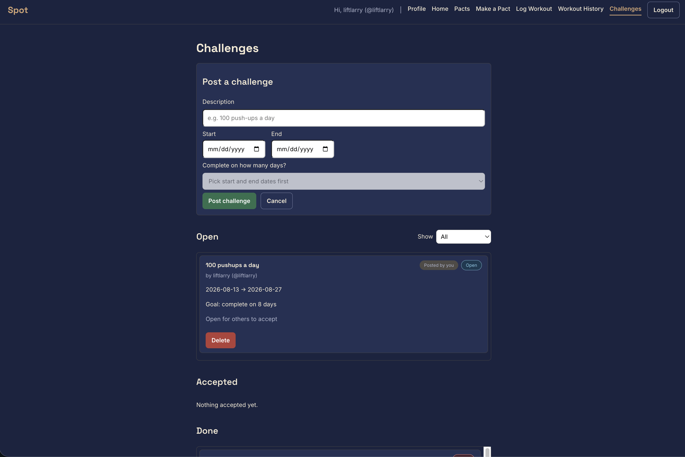
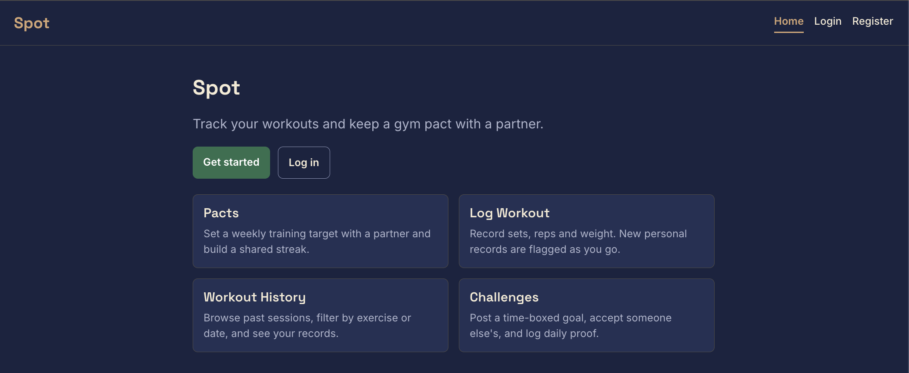

# Spot

A full-stack workout accountability app built with Node.js, Express, MongoDB
(native driver), and a React (Hooks) client-side-rendered frontend built with Vite.
Pair up with a partner, set a weekly workout target, and keep each other honest.

**Live Website:** [https://spot-gwig.onrender.com/](https://spot-gwig.onrender.com/)

**Demo Video:** _TODO: add video link_

**Try it:** log in with the demo account **`liftlarry`** / **`demospot123`** to explore
an account already full of pacts, streaks, workout history, and challenges — or
register your own account to start fresh.

> The live site is on Render's free tier, so the first request after a period of
> inactivity may take 30–60 seconds to wake the server.

---

## About

Spot is built for CS5610 Web Development at Northeastern University. Most people
don't quit the gym because they lack a plan - they quit because nobody notices
when they skip. Spot is built around accountability between friends. Users log
their workout sessions (exercises, sets, reps, weight) and the app automatically
flags new personal records (PRs). On top of the logs, users form **pacts** with a
partner — a shared weekly target like "we each train 3 times a week." Each week the
app checks both partners' logged sessions; the week only clears if both hit the
target, and cleared weeks build a shared streak that breaks for both if one person
slacks. Users can also post one-off **challenges** ("100 push-ups a day for 7 days")
that others accept and complete within a time window. It uses four MongoDB
collections (users, sessions, challenges, pacts), each with full CRUD, exposed
through a REST API and rendered entirely in the browser with React.

---

## Pages

- **Login / Register** (`/login`, `/register`): Create an account or sign in;
  authentication is session-based via Passport.
- **Dashboard** (`/`): Your pacts and their shared streaks, with a link to make a
  pact if you have none yet.
- **Make a Pact** (`/search`): Search users by username to start a pact.
- **Profile** (`/profile`): View and edit your profile, or delete your account.
- **Log Workout** (`/log`): Log a session with a date, one or more exercises
  (sets/reps/weight), and notes; new personal records are flagged on submit.
- **Session History** (`/history`): Browse past sessions with filters by exercise
  and date range, edit or delete records, and see PR-highlighted lifts.
- **Challenges** (`/challenges`): Post challenges, browse open ones, accept them,
  and log daily proof entries; challenges are grouped into Open / Accepted / Done.

---

## Key Features

**Sessions & PRs**

- Full CRUD — log, view, edit, and delete workout sessions
- Automatic personal-record detection: each logged lift is compared against the
  user's prior best for that exercise (via a MongoDB aggregation pipeline) and
  flagged if it's a new PR
- Session history with combinable filters (exercise name, date range) done
  client-side for instant feedback
- PR-highlighted display so progress is visible at a glance

**Challenges**

- Full CRUD — create, browse, and delete challenges
- Lifecycle: `open` -> `accepted` -> `completed` / `failed`
- Accept an open challenge and log daily proof entries during the window
- Fail-fast rule — a single missed day fails the challenge immediately
- Grouped into Open / Accepted / Done sections; Accepted and Done are scoped to
  the logged-in user

**Pacts & Streaks**

- Full CRUD on pacts — create with a partner and weekly target, view the pact
  dashboard, edit the target, dissolve the pact
- Weekly pact-clearing logic — counts each partner's sessions for the current week
  against the target and advances or resets the shared streak

**Accounts & Auth**

- Register / login / logout with Passport (local strategy), session-based
- Passwords hashed with bcrypt; password hashes never leave the API
- Partner search and profile management

---

## Tech Stack

- **Node.js + Express** — REST API (ES modules)
- **MongoDB (native Node.js driver)** — four collections (`users`, `sessions`bro y,
  `challenges`, `pacts`), no Mongoose
- **React (Hooks) + React Router** — client-side rendering with the Fetch API,
  built with Vite
- **Passport + bcrypt** — session-based authentication
- **ESLint + Prettier** — code quality and formatting

---

## Install & Run

The app has two parts: a backend (`server/`) and a frontend (`frontend/`), each
with its own dependencies. It runs against a MongoDB Atlas cluster.

1. **Clone and install**

   ```bash
   git clone https://github.com/nipunjay10/Spot.git
   cd Spot

   # backend
   cd server
   npm install

   # frontend
   cd ../frontend
   npm install
   ```

2. **Set the connection string.** Create a `.env` file in `server/`:

   ```
   MONGO_URI=your-mongodb-atlas-connection-string
   PORT=3001
   SESSION_SECRET=any-random-string
   ```

   > `.env` is gitignored and never committed.

3. **Load the data.** A full snapshot of the database lives in `server/data/` —
   over 1,000 records across the collections. Import the per-collection JSON
   backups with `mongoimport`:

   ```bash
   mongoimport --uri "$MONGO_URI/spot" --collection users        --jsonArray --file server/data/json/users.json
   mongoimport --uri "$MONGO_URI/spot" --collection sessions     --jsonArray --file server/data/json/sessions.json
   mongoimport --uri "$MONGO_URI/spot" --collection challenges   --jsonArray --file server/data/json/challenges.json
   mongoimport --uri "$MONGO_URI/spot" --collection pacts        --jsonArray --file server/data/json/pacts.json
   mongoimport --uri "$MONGO_URI/spot" --collection acceptances  --jsonArray --file server/data/json/acceptances.json
   ```

   > For an exact copy (indexes and all) you can instead restore the binary dump
   > in `server/data/dump/`:
   > `mongorestore --uri "$MONGO_URI" --nsInclude "spot.*" --drop server/data/dump`.

4. **Start both servers** (two terminals):

   ```bash
   # terminal 1 — backend (from server/)
   npm run dev

   # terminal 2 — frontend (from frontend/)
   npm run dev
   ```

5. Open the Vite dev URL (usually **[http://localhost:5173](http://localhost:5173)**).
   The frontend proxies `/api` requests to the backend on port 3001. Register an
   account and start logging workouts.

---

## Screenshots

### Login



### Register



### Dashboard (Pacts)


### Make a Pact (Partner Search)



### Pact Detail



### Profile



### Log Workout



### Session History



### Challenges



---

## Project Structure

```
Spot/
├── server/
│   ├── server.js               # Express entry point; mounts routes + serves the built frontend
│   ├── db/
│   │   ├── connection.js       # Single cached MongoDB connection
│   │   ├── usersDb.js          # Users collection access
│   │   ├── pactsDb.js          # Pacts collection access
│   │   ├── sessionCountsDb.js  # Weekly session counts (for streaks)
│   │   ├── challengesDb.js     # Challenges collection access
│   │   └── acceptancesDb.js    # Per-user challenge acceptances
│   ├── auth/
│   │   └── passport.js         # Passport local strategy + (de)serialize
│   ├── lib/
│   │   └── streak.js           # Week-math helpers + streak computation
│   ├── middleware/
│   │   ├── ensureAuthenticated.js
│   │   └── requireValidId.js   # Validates :id params as ObjectIds
│   ├── routes/
│   │   ├── auth.js             # /api/auth (register/login/logout/me)
│   │   ├── users.js            # /api/users (search + profile CRUD)
│   │   ├── pacts.js            # /api/pacts (CRUD + weekly streak logic)
│   │   ├── sessions.js         # /api/sessions (CRUD + PR detection)
│   │   └── challenges.js       # /api/challenges (CRUD + lifecycle)
│   └── data/                   # Full database snapshot (BSON dump + JSON backups)
├── frontend/
│   ├── vite.config.js
│   └── src/
│       ├── App.jsx             # Router + auth state
│       ├── components/         # NavBar, Layout, ProtectedRoute, cards, sections, forms
│       └── pages/              # Dashboard, Login, Register, Profile,
│                               # PartnerSearch, PactDetail, LogWorkout,
│                               # History, Challenges
├── README.md
├── LICENSE                     # MIT
└── package.json
```

---

## API

All endpoints return JSON. Session, challenge, pact, and streak routes require an
authenticated session; the logged-in user is read from the session (`req.user`),
not the request body.

### Auth — `/api/auth`

| Method | Path                 | Description                          |
| ------ | -------------------- | ------------------------------------ |
| `POST` | `/api/auth/register` | Register a new user and log them in. |
| `POST` | `/api/auth/login`    | Log in.                              |
| `POST` | `/api/auth/logout`   | Log out and end the session.         |
| `GET`  | `/api/auth/me`       | Get the currently logged-in user.    |

### Sessions — `/api/sessions`

| Method   | Path                | Description                                                                       |
| -------- | ------------------- | --------------------------------------------------------------------------------- |
| `GET`    | `/api/sessions`     | List the logged-in user's sessions (newest first).                                |
| `POST`   | `/api/sessions`     | Log a session; each exercise is flagged `isPR` if it beats the user's prior best. |
| `GET`    | `/api/sessions/:id` | Get one session by id.                                                            |
| `PUT`    | `/api/sessions/:id` | Update a session.                                                                 |
| `DELETE` | `/api/sessions/:id` | Delete a session.                                                                 |

### Challenges — `/api/challenges`

| Method   | Path                         | Description                                                                              |
| -------- | ---------------------------- | ---------------------------------------------------------------------------------------- |
| `GET`    | `/api/challenges`            | List challenges, each enriched with the creator and the logged-in user's own acceptance. |
| `POST`   | `/api/challenges`            | Create a challenge (creator = logged-in user).                                           |
| `PUT`    | `/api/challenges/:id/accept` | Accept an open challenge (creates the caller's acceptance).                              |
| `POST`   | `/api/challenges/:id/day`    | Toggle a day done on the caller's acceptance; completing the target resolves it.         |
| `DELETE` | `/api/challenges/:id`        | Delete a challenge (creator only, before anyone accepts).                                |

### Pacts — `/api/pacts`

| Method   | Path                    | Description                                                                                                |
| -------- | ----------------------- | ---------------------------------------------------------------------------------------------------------- |
| `GET`    | `/api/pacts`            | List the logged-in user's pacts, each with the partner, the current shared streak, and this week's counts. |
| `POST`   | `/api/pacts`            | Propose a pact to a partner with a weekly target.                                                          |
| `GET`    | `/api/pacts/:id`        | Get one pact.                                                                                              |
| `PUT`    | `/api/pacts/:id`        | Update a pact's weekly target.                                                                             |
| `PUT`    | `/api/pacts/:id/accept` | Accept a pact proposed to you (activates the pact).                                                        |
| `DELETE` | `/api/pacts/:id`        | Dissolve a pact.                                                                                           |

### Users — `/api/users`

| Method   | Path                       | Description                                                   |
| -------- | -------------------------- | ------------------------------------------------------------- |
| `GET`    | `/api/users?search=<term>` | Search users by username or display name (excludes yourself). |
| `GET`    | `/api/users/:id`           | Get one user's public profile.                                |
| `PUT`    | `/api/users/:id`           | Update your own profile.                                      |
| `DELETE` | `/api/users/:id`           | Delete your own account.                                      |

---

## Design, Accessibility & Usability

### Colour palette

Every colour in the app is a CSS variable defined in `frontend/src/index.css` — no
`.module.css` file contains a hex value, so the whole palette can be changed from one
place. The base is a dark navy and warm gold scheme from
[fontpair.co](https://www.fontpair.co/):

| Token | Hex | Used for |
| --- | --- | --- |
| `--page` | `#1A2340` | page background |
| `--card` | `#243054` | cards and panels |
| `--text` | `#F4EAD5` | body text |
| `--primary` | `#D4A574` | links, active nav item, "Spot" wordmark |
| `--accent` | `#E8C77A` | stat numbers, streak tile, PR badges and weights |
| `--border` | `#4E4B46` | card edges |

That palette gives six colours and the app needs a few more, so the rest are derived
from it rather than picked at random: `--card-raised` (`#2E3C66`, the card colour
lightened a step, used for stat tiles and zebra stripes), `--border-strong`
(`#8A93B5`, for input borders), and `--muted` (`#AEB4CC`, for secondary text).

### Approve and cancel colours

The palette has no red or green, so two semantic colours were added — they're the one
deliberate exception to "everything comes from the palette," because gold-on-gold
can't tell a user the difference between confirming and deleting.

- **Green `#2E6F4E`** — Accept, Save, Post, Log
- **Red `#B3403A`** — Decline, Delete, and errors

Red is only ever used for actions that destroy data. A Cancel button that just closes
a form is neutral, not red.

These two are used as *button fills* with a white label. Where the same meaning shows
up as **text** — an error message, a "Saved" confirmation — lighter tints are used
instead (`#F09490` and `#7FD6A2`), because a colour dark enough to hold white text is
too dark to read as text itself.

### Typography

- **Space Grotesk for headings, Inter for body text**, loaded from Google Fonts.
  The pairing comes from the same fontpair.co entry as the colour palette, so the
  type and the colours are one system rather than two separate choices.
- **Six size tokens** replace the 12 ad-hoc sizes the app had before, each step 1.25x
  the one below it: `--text-xs` (12px) through `--text-2xl` (32px). Sizes like `16px`
  and `0.9rem` were being used for the same job; they now share one token.
- **Four weight tokens** (400/500/600/700). The app previously had only six
  font-weight declarations total, so hierarchy rested almost entirely on size, which
  made everything read flat.
- **Headings are styled by element**, not by class — `h1` and `h2` pick up the display
  font and their size automatically. No component needed a JSX change.
- **Numbers use tabular figures** (`font-variant-numeric: tabular-nums`) in the stat
  tiles and PR list, so digits stay a fixed width and columns don't shift as values
  change. This is the main reason Inter was chosen for body text.

### Spacing & layout

- **Six spacing tokens on a 4px grid** (`--space-1` 4px through `--space-6` 24px)
  replace roughly 140 hand-picked padding, margin and gap values. Most of the app was
  already on multiples of 4; the odd `2px`, `6px` and `10px` values were the drift,
  and they now snap to the nearest step.
- **One content width.** Pages used to be 600px, 800px or 1000px, so the content
  column visibly jumped as you moved between them. They now share `--page-width`
  (800px). Login and Register keep a narrower `--page-width-narrow` (400px), since a
  short form stretched to full width reads as broken.
- **Two corner radii** (`--radius` for boxes, `--radius-pill` for status pills)
  replace the five different values that were in use.
- **Inputs and buttons share one size rule**, so a text field and the button beside
  it are the same height. They previously differed by 2px, which was enough to make
  every form row look slightly off.

### Semantic HTML

Elements are chosen for what the content *is*, not for the box it needs, so the
document outline a screen reader announces matches the hierarchy a sighted user sees.

- **Every page has exactly one `<h1>`, and heading levels never skip.** Nine pages,
  nine `h1`s. The `h1` is the page title, `h2` marks the groupings inside it
  (`PactSection`, `ChallengeSection`, the PR board), and `h3` the cards within those.
- **Page structure uses landmarks.** `Layout.jsx` wraps the navigation in `<nav>` and
  the routed page in `<main>`, so assistive tech can skip straight to the content
  instead of walking the nav on every page.
- **Repeated cards are `<article>`.** Pact, user, session and challenge cards are each
  self-contained — still meaningful lifted out of their list — which is exactly what
  `<article>` marks. They were `<div>`s.
- **A block that owns a heading is a `<section>`**, never a generic wrapper. The
  dashboard's pact groups, the challenge groups, the records board, the history filter
  row and the log-workout result all follow this; pure layout wrappers stay `<div>`.
- **Forms are labelled and grouped.** All 23 `<label>` elements carry `htmlFor`
  pointing at their input's `id`, and the repeating exercise inputs sit inside a
  `<fieldset>` with a `<legend>` naming the group.
- **Every control is a real element.** All 16 buttons are `<button>` with an explicit
  `type`; navigation goes through React Router's `Link`/`NavLink`, which render real
  `<a>` elements. There are no click-handling `<div>`s, so keyboard focus and
  Enter/Space work without any extra code.

**Heading level tracks structure; font size tracks emphasis.** The pact card's name is
an `<h3>` so it nests correctly under its section's `<h2>`, but `.pactCard h3` sets
`font-size: var(--text-xl)` to keep the size it had — the outline changed, the design
didn't. The challenge card's description was a `<strong>`, which left those cards out
of the outline entirely; it is now an `<h3>` holding its original body size and weight.

### Accessibility

- Every colour pair used in the app was measured against WCAG AA (4.5:1 for text,
  3:1 for interactive elements). All 30 pairs pass — the lowest text value is 5.22:1.
- Card borders and status-pill fills sit below that ratio on purpose. WCAG exempts
  purely decorative edges, and every status pill carries a border in its own text
  colour so the shape reads regardless of its fill.
- The nav marks the current page with both the accent colour **and** an underline, so
  colour is never the only signal. It uses React Router's `NavLink`, which adds
  `aria-current="page"` for screen readers.
- **Body text uses a 1.5 line height**, which is the minimum WCAG 1.4.12 (Text
  Spacing) asks for.
- **The type scale is defined in `rem`, not `px`**, so the whole app scales with the
  reader's browser font-size setting. A pixel-based scale would silently ignore it.
- **Form controls share a consistent hit area** through the same padding rule, which
  is what WCAG 2.5.8 (Target Size) is concerned with.

---

## Issues Fixed

**Visited links turned purple.** Every nav tab went purple once its page had been
visited, so after clicking around the whole nav looked highlighted and gave no clue
which page you were actually on. This wasn't a browser setting — the nav links had no
styling at all, so Chrome fell back to its own default link colours (blue unvisited,
purple visited). Fixed by styling all links in `index.css`; the current page is now
marked deliberately with `NavLink`.


**Save changes and Delete account touched on the Profile page.** Save is the last
element inside `<form className={styles.profileForm}>` while Delete account is a
sibling outside it, so the form's `gap` never applied between the two and they ran
together. Delete account is now wrapped in a `.profileDanger` div carrying
`margin-top: var(--space-6)` and a `border-top`, which separates a destructive action
from an ordinary one rather than only adding space.

**The Start and End labels sat flush against their date inputs on Challenges.**
`.challengeCreateDates` set a `gap` between the two date groups, but the inner `div`
wrapping each label and input had no rule at all, so both defaulted to inline flow and
rendered touching. A `.challengeCreateDates > div` rule now makes each field a column
flexbox with `gap: var(--space-1)`.

**Everything on a challenge card looked equally unimportant.** `.challengeCreator`,
`.challengeWindow` and `.challengeTarget` all used `color: var(--muted)`, so the dates
and goal read as no more important than who posted it, and the days-completed count was
concatenated into the goal line as unstyled text (`Goal: complete on 5 days — 1 / 5
done`). The window and goal now use `var(--text)`, leaving the byline as the only muted
line, and the count moved to its own `.challengeProgress` paragraph in `var(--accent)`
at semibold with `tabular-nums`, matching the stat tiles and PR weights.

---

## Authors

**Nipun Jayakumar** — Sessions, PR detection, and Challenges
[GitHub](https://github.com/nipunjay10)

**Khush Patel** — Users, Authentication, and Pacts
[GitHub](https://github.com/kmpat339)

---

## Academic Reference

This project was created as part of the **Web Development Course (Summer 2026)** at
Northeastern University.

- **Course**: [CS5610 Web Development — Northeastern University](https://johnguerra.co/classes/webDevelopment_online_summer_2026/)
- **Instructor**: John Alexis Guerra Gómez

---

## Project Submissions

- **Design document:** [Design Document - Project 3.pdf](<./submission materials/Design Document - Project 3.pdf>)
- **Slide deck:** [Spot-Project3-Slidedeck.pptx](<./submission materials/Spot-Project3-Slidedeck.pptx>)
- **Video presentation:** _TODO: link the demo video_
- **Thumbnail image:** 

---

## Use of GenAI Tools

This section discloses where generative AI was used in this project. We used the
Claude Opus 4.8 model.

1. **Seed data generation.** Sample data for the sessions and challenges collections
   was generated with [Mockaroo](https://www.mockaroo.com/). Claude was used to help write
   the Node loader scripts that shaped the flat Mockaroo rows into the nested document
   structure the app expects (wrapping session exercise fields into an `exercises`
   array, converting id strings to native MongoDB `ObjectId`s, and setting
   `accepterId` to `null` for unaccepted challenges). The final database now ships as
   a snapshot in `server/data/`.

2. **Scaffolding and debugging.** Claude was used as a coding aid to scaffold the
   sessions and challenges routes, the PR-detection aggregation pipeline, the
   challenge lifecycle logic, the pact-clearing streak logic, and the React frontend
   pages, and to help debug along the way. All decisions, validation rules, API
   design, and final code were reviewed and understood by the team.

3. **Build guidance.** Claude was used throughout the project to talk through
   Express / MongoDB / React concepts and review approach. All implementation
   choices were made and verified by the team.

---

## Contributing

This is a course project submission. External contributions are not accepted.

---

## License

This project is licensed under the MIT License. See [LICENSE](LICENSE) for details.
